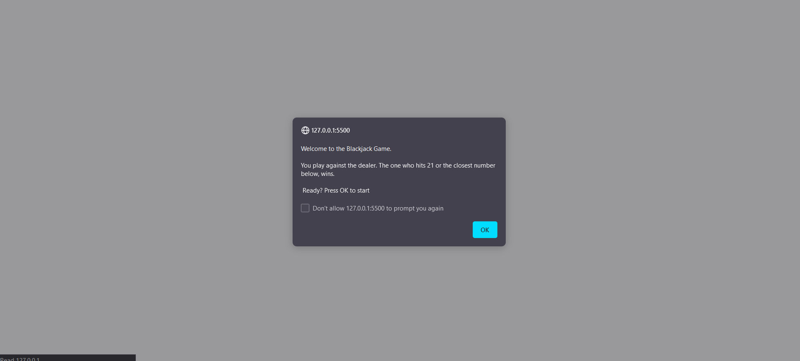

# 🃏 Blackjack Game 🃏
Welcome to my first JavaScript game— a simple yet thrilling Blackjack experience!

## 🚀 Live Version

Check out the live version of the Blackjack Game [HERE](https://thevisualriot.github.io/blackjack-game/)

## 📝 Description
This game is a digital adaptation of the classic card game, Blackjack. The rules are straightforward: Players and the dealer receive cards, and their goal is to reach a total of 21 or the closest without exceeding it.

## 🔣 Functionality
Several key features enhance the complexity of this game:

1. In the initial round, the player is dealt a random number between 1 and 21. Based on this score, they decide whether to hit and receive another card or stand.

2. If the player chooses to hit, the dealer draws a card between 2 and 11. Simultaneously, the player gets another card, and their total is displayed, prompting them to decide whether to hit or stand.

3. The game continues until one of the following conditions is met:
    - The player hits 21 and wins.
    - The dealer hits 21 and wins.
    - The player or dealer busts, exceeding a total of 21.
    - The player decides to stand.

4. Notably, when the dealer's total is between 17 and 21, the dealer stands automatically. However, the player can still choose to hit.

5. If the player decides to stand, the totals of the player and the dealer are compared to determine the winner based on proximity to 21.

## 💻 JS Elements

#### Pop up boxes
The game utilizes `alert()` and `confirm()` functions for text-based interaction. All information and decisions are conveyed and recorded through these functions.

#### While loop
A while loop is employed to run the game until the player chooses to `stand [cancel].`

#### If statement
Conditional statements are utilized to execute different functions based on randomized outcomes.

#### Random
`Math.random()` is used to generate random cards for both the player and the dealer.

#### Functions
Functions are implemented to reduce redundancy in the code, promoting maintainability and readability.

## 📜 License
This project is licensed under the [MIT License](https://choosealicense.com/licenses/mit/)